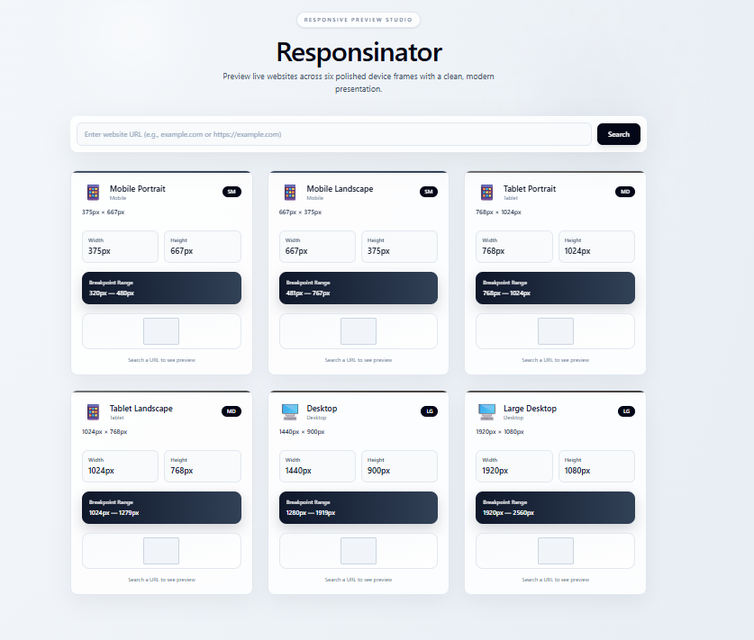

<!-- prettier-ignore -->
# Responsinator


A refined, minimal tool to preview live websites inside beautifully styled device frames. Use single or grid views, filter devices, zoom, proxy public sites for iframe embedding, and quickly capture screenshots.

Demo



Contents

- Features
- Quick Start
- Usage
- Project structure
- Implementation notes
- Contributing & License

---

## Features

- Polished device presets: mobile, tablet, desktop (including landscape variants)
- Single and grid view modes with smooth UI controls
- Device filtering and zoom with resets
- Optional CORS proxy for public sites to bypass iframe restrictions
- Screenshot capture (client-side)
- Responsive, accessible UI built with Tailwind CSS

## Quick Start

Requirements

- Node.js 16+ (Node 18+ recommended)

Install dependencies and run the dev server:

```bash
npm install
npm run dev
```

Open the app at http://localhost:5173 (Vite default).

Available scripts (see `package.json`):

- `npm run dev` — start development server
- `npm run build` — build production bundle
- `npm run preview` — preview the production build
- `npm run lint` — run ESLint

## Usage

1. Enter a website URL in the search input (you can type example.com — the app adds `https://` automatically).
2. Click Search to load the site into the device frames. Local addresses (`localhost`, `127.0.0.1`) load directly; public sites are optionally proxied.
3. Toggle between **Single** and **Grid** view, pick devices, adjust zoom, and click **Screenshot** to download a PNG of the visible preview area.

Tip: If a site blocks embedding, enable the proxy toggle (the app will use `https://corsproxy.io/?...`).

## Project structure

- `index.html` — Vite entry
- `src/main.jsx` — React bootstrap
- `src/App.jsx` — root component
- `src/components/DevicePreview.jsx` — device presets, UI and preview logic
- `src/index.css`, `src/App.css` — styles
- `vite.config.js` — Vite configuration

## Implementation notes

- Device definitions (name, width, height, min/max breakpoints, styles) live in `src/components/DevicePreview.jsx`.
- Iframe source handling:
	- Localhost and `127.0.0.1` are loaded directly.
	- Public sites are wrapped with `https://corsproxy.io/?${encodeURIComponent(url)}` when the proxy toggle is enabled.
- Screenshot capture expects a client-side canvas snapshot (the code references `html2canvas` — add it if you want higher fidelity screenshots).

## Accessibility & UX

- Controls are keyboard-focusable and have clear visual states.
- Layout scales with zoom and supports small-screen usage for the control panel.

## Contributing

Contributions welcome — please open an issue to discuss major changes.

Small fixes

1. Fork the repo
2. Create a topic branch
3. Open a PR describing the change

## License

MIT

------------------- END--------------------


